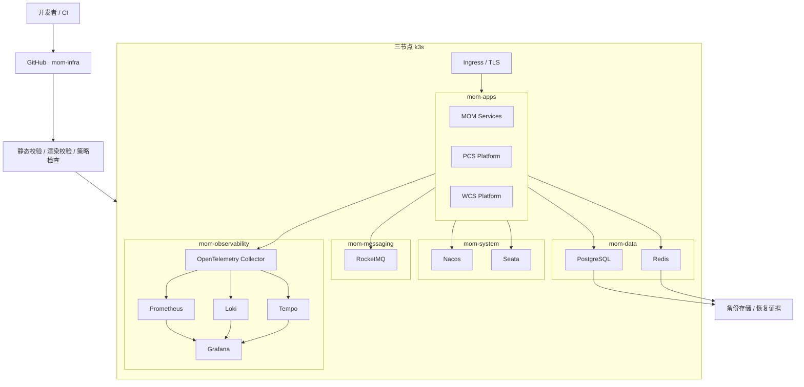

<div align="center">

# MOM Infrastructure

### 工业 MOM 的基础设施即代码与生产级运维实验场

为 `mom-platform`、`pcs-platform`、`wcs-platform` 及配套前端和模拟器提供统一的 k3s 部署、中间件、可观测性、安全、备份恢复与故障演练基座。

<p>
  <a href="https://github.com/Chris-co-shi/mom-infra/actions/workflows/validate.yml">
    
  </a>
  
  
  
  
</p>

[文档中心](docs/README.md) · [总体架构](docs/architecture/基础设施总体架构.md) · [环境模型](docs/environments/环境模型与晋级规则.md) · [Phase 01 计划](docs/plans/Phase-01-基础设施计划.md) · [运行手册](docs/runbooks/运行手册规范.md)

</div>

---

> [!IMPORTANT]
> 当前仓库处于 **V1 基础设施骨架阶段**。已建立目录边界、环境 Overlay、命名空间、版本目录和校验脚本，但尚未提供可直接用于生产的完整中间件部署。

> [!NOTE]
> 所有文档新增、修改、重命名和整理统一在 `agent/complete-chinese-docs` 分支进行，再通过 PR 合并到 `main`。

## 🌟 仓库使命

`mom-infra` 是 MOM 项目的基础设施与运维权威仓库，负责把应用仓库输出的镜像、端口、健康检查和资源需求，转换为可审查、可验证、可回滚的运行环境。

它重点解决：

- 三节点 k3s 的环境组织与部署治理。
- PostgreSQL、Redis、Nacos、RocketMQ、Seata 的部署边界。
- OpenTelemetry、Prometheus、Loki、Tempo、Grafana 的可观测性闭环。
- Ingress、TLS、NetworkPolicy、RBAC 和密钥管理。
- 本地、开发、测试、类生产环境的一致晋级。
- 备份、恢复、滚动升级、回滚与生产级故障演练。
- 基础设施漂移识别和 Git 权威源治理。

## 🧭 基础设施全景



## 🧩 能力边界

| 能力域 | 本仓库负责 | 不负责 |
|---|---|---|
| k3s/Kubernetes | Namespace、Kustomize、部署资源、健康检查 | 业务代码与业务行为 |
| 中间件 | 版本、拓扑、存储、资源、升级、恢复 | 领域表结构与消息载荷定义 |
| 可观测性 | Collector、指标、日志、追踪、仪表盘 | 应用业务埋点逻辑 |
| 网络与安全 | Ingress、TLS、NetworkPolicy、RBAC、密钥流程 | 应用权限模型实现 |
| 环境治理 | local/dev/test/prod-like Overlay 与晋级规则 | 临时手工修改长期保留 |
| 备份与容灾 | 备份作业、恢复流程、RPO/RTO、证据 | 仅声明“已备份”而不做恢复验证 |
| 故障演练 | 场景、爆炸半径、停止条件、恢复与复盘 | 无控制的破坏性操作 |

## 🗂️ 仓库结构

```text
mom-infra/
├── config/                 # 组件版本目录与共享元数据
├── docs/                   # 架构、计划、ADR、运行手册
├── environments/           # local / dev / test / prod-like Overlay
├── kubernetes/             # 环境无关的 Kubernetes Base
├── middleware/             # 中间件部署边界与配置
├── observability/          # 指标、日志、追踪和仪表盘
├── networking/             # Ingress、DNS、TLS、网络策略
├── security/               # Secret、RBAC、镜像与供应链策略
├── backup/                 # 备份作业与恢复流程
├── disaster-recovery/      # RPO/RTO 与灾难恢复演练
├── fault-drills/           # 受控故障场景
└── scripts/                # 校验与运维辅助脚本
```

## 🛠️ 目标技术栈

| 层次 | 组件 |
|---|---|
| 集群 | k3s、Kubernetes、Kustomize |
| 入口 | Ingress Controller、TLS |
| 数据 | PostgreSQL、Redis |
| 注册配置 | Nacos |
| 消息 | RocketMQ |
| 分布式事务 | Seata |
| 遥测入口 | OpenTelemetry Collector |
| 指标 | Prometheus |
| 日志 | Loki |
| 追踪 | Tempo |
| 可视化 | Grafana |
| 自动校验 | GitHub Actions、YAML Lint、ShellCheck、自定义脚本 |

所有组件版本、镜像和来源最终由 [`config/component-versions.yaml`](config/component-versions.yaml) 锁定；`prod-like` 禁止使用浮动 Tag。

## 🌍 环境晋级

```text
local → dev → test → prod-like
```

| 环境 | 用途 | 数据策略 | 可用性预期 |
|---|---|---|---|
| `local` | 开发者验证 | 可丢弃 | 单节点可接受 |
| `dev` | 多服务共享集成 | 可重建 | 允许短时中断 |
| `test` | 端到端与故障测试 | 需要备份 | 模拟关键拓扑 |
| `prod-like` | 面试演示与生产模拟 | 受保护 | 三节点 k3s 目标 |

环境差异只能通过 Overlay 和外部 Secret 表达；禁止直接修改运行集群后不回写 Git。

## 🚀 快速验证

### Linux / macOS

```bash
./scripts/validate.sh
```

### Windows PowerShell

```powershell
./scripts/validate.ps1
```

### Make

```bash
make validate
```

当前校验重点包括：

- YAML 基础语法和风格。
- Shell 脚本静态检查。
- 目录与基础资源存在性。
- 禁止提交常见凭证和私钥文件。
- 后续逐步加入 Kustomize 渲染、Schema、镜像 Tag 和策略校验。

## 📚 文档导航

| 分类 | 文档 | 说明 |
|---|---|---|
| 总览 | [文档中心](docs/README.md) | 文档结构和维护约定 |
| 架构 | [基础设施总体架构](docs/architecture/基础设施总体架构.md) | 集群、命名空间和组件关系 |
| 架构 | [仓库边界](docs/architecture/仓库边界.md) | 本仓库与应用仓库的职责划分 |
| 环境 | [环境模型与晋级规则](docs/environments/环境模型与晋级规则.md) | Overlay、晋级和漂移治理 |
| 计划 | [Phase 01 基础设施计划](docs/plans/Phase-01-基础设施计划.md) | 当前阶段的实施顺序和验收 |
| 运维 | [运行手册规范](docs/runbooks/运行手册规范.md) | Runbook 的标准结构 |
| 安全 | [安全与密钥管理](docs/security/安全与密钥管理.md) | Secret、RBAC 和供应链边界 |
| 可观测性 | [可观测性基础设施](docs/observability/可观测性基础设施.md) | Metrics、Logs、Traces 闭环 |
| 容灾 | [备份恢复与容灾](docs/disaster-recovery/备份恢复与容灾.md) | RPO/RTO、恢复顺序和证据 |
| 演练 | [故障演练计划](docs/fault-drills/故障演练计划.md) | 受控故障场景和停止条件 |
| 决策 | [ADR 索引](docs/adr/README.md) | 基础设施架构决策 |

## 🗺️ 当前路线图

| 阶段 | 目标 | 状态 |
|---|---|---|
| Infra Phase 01 | 版本矩阵、Namespace、校验、基础可观测性 | 🚧 进行中 |
| Infra Phase 02 | PostgreSQL、Redis、Nacos、RocketMQ、Seata 部署 | ⏳ 计划中 |
| Infra Phase 03 | MOM/PCS/WCS 应用部署与环境晋级 | ⏳ 计划中 |
| Infra Phase 04 | 备份恢复、滚动升级、回滚和故障演练 | ⏳ 计划中 |

### 当前优先事项

- [ ] 冻结组件版本、镜像来源和许可证信息。
- [ ] 完成 Kustomize Base 与四套 Overlay 的渲染验证。
- [ ] 确定 StorageClass、持久卷和容量基线。
- [ ] 落地 Secret 管理方案，禁止明文凭证。
- [ ] 接通 OTel Collector、Prometheus、Loki、Tempo、Grafana。
- [ ] 建立 PostgreSQL 和 Redis 的恢复验证流程。
- [ ] 为关键中间件补充部署、升级、回滚和故障 Runbook。

## 🧠 基础设施原则

1. **Git 是权威源**：手工集群变更必须回写或回滚。
2. **环境差异显式化**：差异只存在于 Overlay 和外部 Secret。
3. **版本必须锁定**：类生产环境使用固定版本和镜像 Digest。
4. **密钥不得入库**：Git 中只保存引用、模板和加密后材料。
5. **备份必须可恢复**：未通过恢复测试的备份不算有效。
6. **变更必须可回滚**：破坏性操作必须有停止条件和恢复步骤。
7. **可观测性先于演练**：没有信号、告警和证据时不开展故障注入。
8. **仓库边界清晰**：基础设施仓库不接管应用源码和业务契约。

## 🔗 MOM 项目仓库族

| 仓库 | 职责 |
|---|---|
| `mom-platform` | MOM 后端服务与通用 Framework |
| `pcs-platform` | 生产设备协同和协议适配 |
| `wcs-platform` | 自动仓储调度和设备恢复 |
| `mom-web` | 管理端与门户 |
| `mom-mobile` | PDA、扫码和离线队列 |
| `erp-simulator` | 外部 ERP/SAP 接口模拟 |
| `mom-infra` | 集群、中间件、可观测性和运维治理 |

## 📄 许可证与第三方组件

本仓库采用 MIT License。第三方组件保留各自许可证；引入或部署组件时，必须登记版本、上游地址、许可证、Chart/镜像来源、Digest 和本地修改，详见 [`THIRD-PARTY-NOTICES.md`](THIRD-PARTY-NOTICES.md)。

---

<div align="center">

**MOM Infrastructure — 让部署、观测、恢复和故障演练成为可重复验证的工程能力。**

</div>
