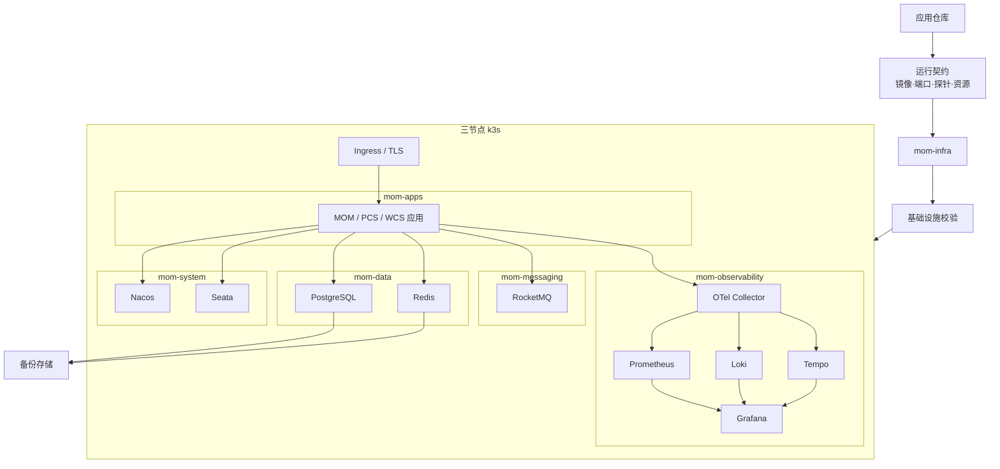

# 基础设施总体架构

- 状态：Draft
- 适用阶段：Infra Phase 01～04
- 关联仓库：`mom-platform`、`pcs-platform`、`wcs-platform`、`mom-web`、`mom-mobile`、`erp-simulator`

## 1. 目标

本架构为工业 MOM 项目提供可重复部署、可观测、可恢复和可演练的运行基座。V1 目标是在三节点 k3s 环境中模拟生产级部署，但不把实验环境描述为真实生产环境。

## 2. 设计原则

1. Git 是基础设施配置的权威来源。
2. Base 保持环境无关，环境差异通过 Overlay 表达。
3. 组件版本、镜像和 Chart 必须锁定。
4. Secret 不以明文进入 Git。
5. Stateful 组件在部署前必须先定义存储、备份和恢复策略。
6. 可观测性先于高可用和故障演练。
7. 变更必须包含验证和回滚路径。
8. 应用仓库拥有业务行为，基础设施仓库拥有运行配置。

## 3. 逻辑架构



## 4. Namespace 规划

| Namespace | 主要内容 | 边界 |
|---|---|---|
| `mom-system` | Nacos、Seata、平台级控制组件 | 不放业务应用和数据服务 |
| `mom-data` | PostgreSQL、Redis | 重点控制持久化、备份和访问策略 |
| `mom-messaging` | RocketMQ | 独立资源与故障域 |
| `mom-observability` | OTel、Prometheus、Loki、Tempo、Grafana | 集中采集和调查 |
| `mom-apps` | MOM、PCS、WCS 及配套服务 | 不直接保存中间件状态 |

Namespace 是治理与权限边界，不代表完整的安全隔离。后续仍需结合 NetworkPolicy、RBAC、ServiceAccount 和 Secret 规则。

## 5. 环境模型

```text
local → dev → test → prod-like
```

所有环境共享 Kubernetes Base，通过 Kustomize Overlay 调整：

- 副本数。
- 资源请求与限制。
- 存储类和容量。
- 域名和 Ingress。
- 外部 Secret 引用。
- 日志级别和采样率。
- 高可用拓扑。

Overlay 不允许复制整套 Base 后独立维护。

## 6. 有状态组件策略

每个 Stateful 组件进入 `test` 或 `prod-like` 前，必须具备：

- 明确的 StorageClass。
- PVC 容量基线。
- 反亲和或拓扑分布策略。
- 健康检查。
- 资源请求和限制。
- 备份范围、频率、保留和加密。
- 恢复 Runbook。
- 升级和回滚方案。
- 故障演练场景。

## 7. 可观测性数据流

```text
应用 / Gateway / 中间件
→ OpenTelemetry Collector
→ Prometheus / Loki / Tempo
→ Grafana
```

应用侧技术标识：

- `trace_id`
- `span_id`
- `service.name`
- `deployment.environment`

业务关联标识：

- `correlation_id`
- `workflow_id`
- `event_id`
- `command_id`
- `factory_id`
- `production_order_no`
- `batch_no`

业务标识不得全部作为 Prometheus Label，避免高基数风险。

## 8. 安全边界

- 禁止提交明文密码、私钥、证书私钥和生成后的 Secret Manifest。
- 运行身份使用 ServiceAccount，不共享高权限账号。
- Ingress TLS、网络访问和管理入口必须显式配置。
- `prod-like` 镜像应使用 Digest 锁定。
- 组件管理端口不默认暴露到公网。
- 备份文件必须加密并限制访问。

## 9. 部署顺序

推荐顺序：

```text
Namespace / Storage / Secret 基础
→ PostgreSQL / Redis
→ Nacos / RocketMQ / Seata
→ OpenTelemetry / Prometheus / Loki / Tempo / Grafana
→ Gateway / IAM / MDM / Integration
→ MES / WMS / QMS / Traceability
→ PCS / WCS / Simulator
```

实际恢复顺序与部署顺序不一定完全相同，应由容灾文档明确。

## 10. 当前限制

当前仓库只完成基础目录、Namespace、Overlay 和校验骨架。以下内容仍需验证后才能声明完成：

- 组件精确版本和镜像 Digest。
- StatefulSet/Operator/Helm 的最终使用方式。
- StorageClass 和容量。
- Secret 管理方案。
- 高可用拓扑。
- 备份恢复实测。
- 告警规则和仪表盘。
- 中间件故障恢复演练。

## 11. 验收标准

总体架构进入 Accepted 前至少满足：

1. 四套环境均能完成 Kustomize 渲染。
2. Namespace、资源命名和标签统一。
3. 所有组件版本和来源有登记。
4. 禁止 `latest` Tag 和明文 Secret 的校验生效。
5. 应用 Trace、Log、Metric 能在 Grafana 关联调查。
6. PostgreSQL 和 Redis 至少完成一次恢复测试。
7. 一次滚动升级和回滚演练成功。
8. 一次节点故障和中间件故障演练有证据。
