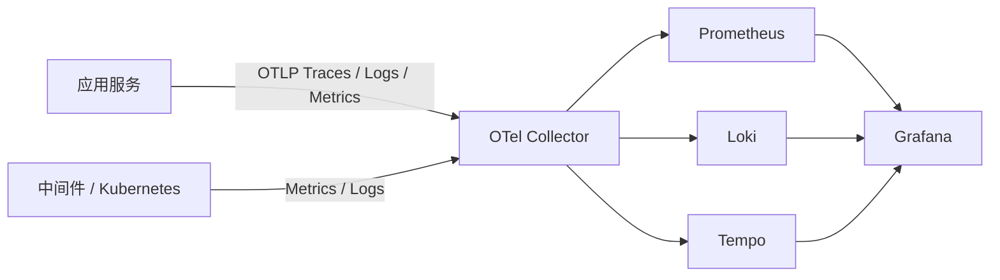

# 可观测性基础设施

## 1. 目标

建立统一的 Metrics、Logs、Traces 采集与调查入口，使应用请求、RocketMQ 消息、定时任务、PCS/WCS 命令和基础设施事件能够关联分析。

## 2. 组件职责

| 组件 | 职责 |
|---|---|
| OpenTelemetry Collector | 遥测接收、处理、采样、补充属性和转发 |
| Prometheus | 指标采集与存储 |
| Loki | 日志存储与查询 |
| Tempo | Trace 存储与查询 |
| Grafana | 统一调查、仪表盘和关联跳转 |

## 3. 数据流

具体采集方式可按组件能力调整，但 Grafana 应作为统一调查入口。

## 4. 资源属性

至少统一：

- `service.name`
- `service.version`
- `deployment.environment`
- `k8s.namespace.name`
- `k8s.pod.name`
- `k8s.node.name`
- `factory_id`（适用时）

禁止将高基数业务字段全部写入 Prometheus Label。

## 5. 技术与业务标识

技术调用链：

- `trace_id`
- `span_id`

长业务流程：

- `correlation_id`
- `workflow_id`
- `event_id`
- `command_id`
- `production_order_no`
- `batch_no`

数小时或数天的业务流程不维持单个超长 Trace，而通过业务关联标识和 Span Link 连接多个 Trace。

## 6. 日志要求

- 使用结构化日志。
- 包含时间、级别、服务、环境、Trace ID 和必要业务关联标识。
- 不记录密码、Token、私钥和敏感数据。
- 明确日志保留周期和磁盘上限。
- Loki 故障不得阻塞核心业务请求。

## 7. 指标要求

基础指标：

- CPU、内存、文件系统、网络。
- Pod 重启、调度和探针失败。
- 请求量、延迟和错误率。
- PostgreSQL 连接、事务、慢查询和存储。
- Redis 内存、命中率、驱逐和连接。
- RocketMQ 堆积、生产消费失败。
- Collector 接收、丢弃和导出失败。

业务相关平台指标示例：

- Gateway 限流允许和拒绝次数。
- Outbox 待发布数量。
- Inbox 重复消息数量。
- PCS/WCS 命令超时和恢复次数。

## 8. Trace 验收场景

至少验证：

1. Browser/PDA → Gateway → MOM 服务。
2. MES → RocketMQ → PCS → MES。
3. WMS → RocketMQ → WCS → WMS。
4. ERP Simulator → Integration Hub → 领域服务。
5. 错误日志能跳转到对应 Trace。
6. Trace 能关联相关日志。
7. 重复消息可看到多次消费尝试但只有一次业务提交。

## 9. 采样策略

- local/dev 可提高采样率便于调试。
- test/prod-like 按流量和存储容量设置。
- 错误、高延迟和关键业务链路优先保留。
- 采样规则变化应记录并可回滚。
- 不因采样丢失业务审计事实。

## 10. 高可用与降级

- Collector 故障不得导致业务服务不可用。
- 日志、指标或 Trace 后端故障时，应用应限量缓冲或丢弃遥测，而不是无限占用磁盘。
- Grafana 不作为业务系统依赖。
- 观测组件本身需要指标、日志和容量告警。

## 11. 容量与保留

进入 test/prod-like 前必须明确：

- Prometheus、Loki、Tempo 的存储容量。
- 指标、日志、Trace 的保留周期。
- 高基数和大日志风险。
- 单日遥测量估算。
- 存储压力时的降级策略。

## 12. 完成标准

- Grafana 可同时查询指标、日志和 Trace。
- 日志与 Trace 双向关联。
- 至少一个异步消息链路可追踪。
- Collector 故障与恢复有 Runbook。
- 存储和保留策略已记录。
- 敏感信息检查通过。
